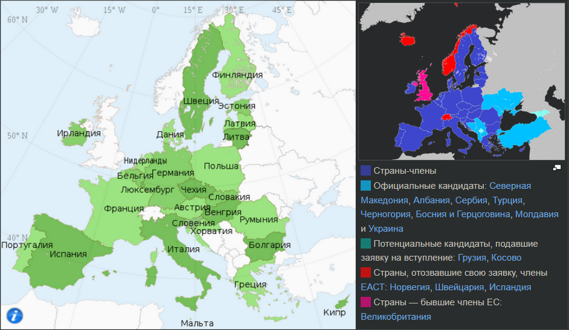

# Европейский союз

Экономическое и политическое объединение стран. Организован в 1992 году. На данный момент включает 27 государств.

В общих чертах, членство в Евросоюзе означает для стран и их граждан удобства по передвижению, учебе, работе, ведению торговли бизнеса. Для всего этого не нужны какие-то специальные документы, все происходит как будто бы это единая страна. Ехай куда хочешь, работай-учись, где хочешь.

Но есть нюанс. Не все страны в союзе равнозначны. Они находятся на разных так называемых "ступенях интерграции". Это означает, что не все преимущества доступны всем участникам. Например, из условной Румынии нельзя просто взять и поехать в условную Францию, нужно все равно оформлять документы. Не во всякой стране можно расплатиться евро и т-д.

Исключить принятую страну из Евросоюза юридически нельзя. Но можно обложить санкциями.