# Предипослесловие

В итоге я думаю, что ключи можно разделить по принципам, которые могут встречаться среди разных видов ключей. 

Например, есть ключи "динамические", у них принцип в том, что можно покрутить механизм и раздвинуть зев до нужных размеров. Специально написал "динамические", потому что не знаю, корректно ли назвать, Стиллсон разводным. Или например у рыжачного трубного ключа тоже есть подкрутка. Но при этом по запросу "разводной ключ" как будто основное большинство показывает некий гаечный ключ.

Есть "самозажимные", у них принцип в том, что есть "крючок" (не нашел названия, придумал сам), который обхватывает цель с одного бока, а когда начинаешь крутить, ручка упирается в другой бок и таким образом получается захват цели. Есть маленькие ключи такого типа, подходят для гаек. А есть и среди трубных ключей. При этом, самозажимные вероятно тоже до некоторой степени являются динамическими (но это не точно).

Одним словом, классификация неоднозначная и возможны "миксы" типов. Так что ориентироваться надо гибко.

# Рожковый гаечный ключ

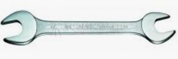

По ГОСТу называется "ключ гаечный с открыты зевом". Захватывает гайку за две грани.

Из минусов - легко смазать грани размере зева больше, чем размер гайки.

# Разводной ключ

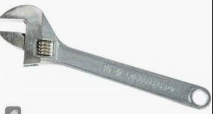

# Самозажимной ключ

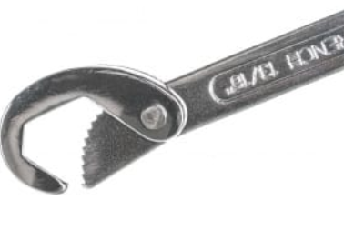

"Крючок" обхватывает гайку с одного бока, а когда давишь на ручку, то ручка упирается в гайку с другого бока и так гайка и обхватывается.

# Трубный ключ

У трубных ключей есть понятие "щеки":

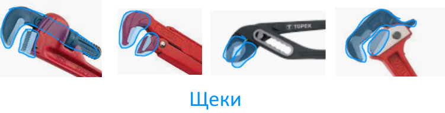

## "Стиллсон" ("американский")

Этот ключ еще называется "американского типа". Бывает прямой и коленчатый:

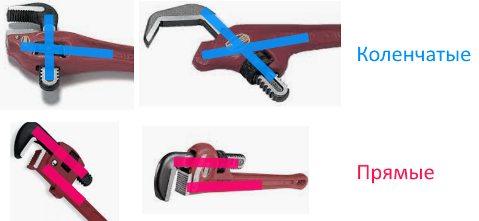

У коленчатых верхняя щека перпендикулярно ручке, а у прямых - параллельно.

## Рычажный ("шведский", "бобковый")

Еще называется *бобковый* или "шведский".

Общий вид:

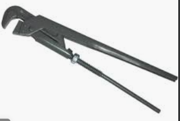

По расположению губок бывает двух типов - S и L:

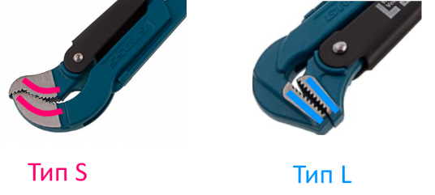

## Самозажимной

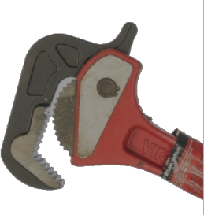

# Накидные гаечные ключи

Накидным называется, потому что покрывает всю гайку.

Из плюсов - за счет большей зоны контакта, чем у рожкового, легче крутить и грани смазываются слабее. Бывает 6-гранный и 12-гранный:

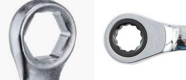

Когда речь идет о головке вот такого вида:

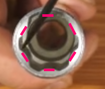

То может быть не понятно, как она "цепляет" гайку. Зацеп идет за счет мест, показанных красным. Т.е. цепляется не за края граней гайки, а за сами грани, за счет чего упрощается откручивание гаек со слизанными гранями.

## Прямой

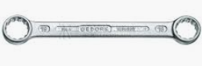

## L-образный (торцевой)

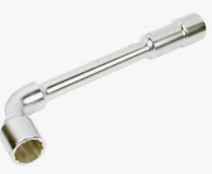

Почему торцевой? Для начала, торец - это боковая грань объекта (у прямоугольных - с меньшей площадью):

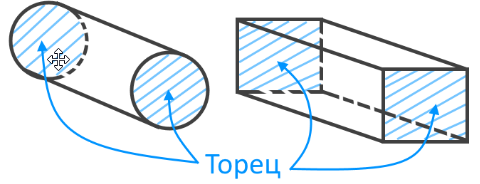

Соответственно, ключ называется торцевым, потому что у него отверстие находится на торцах

## Коленчатый

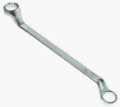

## Серповидный

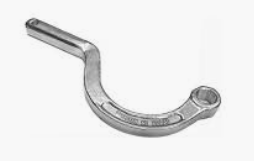

